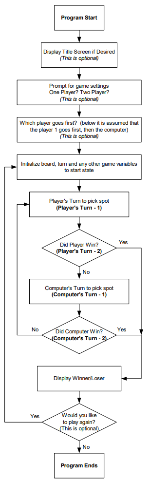
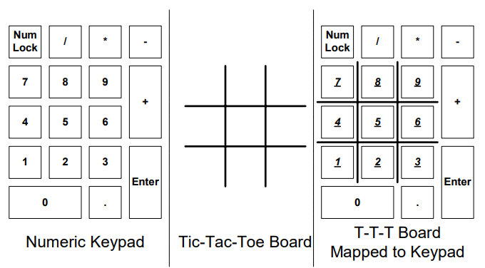

# EECS 2100 Tic-Tac-Toe

The Univeristy of Toledo's [College of Engineering](https://www.utoledo.edu/engineering/?msclkid=39c24dd4a58811ec80a365f57c4806f2) includes an [Electrical Engineering and Computer Science](https://www.utoledo.edu/engineering/electrical-engineering-computer-science/) department, aka EECS. EECS course 2100 covers Computer Organization and Assembly Language. It introduced concepts of computer architecture and software development that formed the basis of computing prior to the widespread availability of higher-level programming languages, as well as a first step into embedded systems.

The third project of the semester included a Tic-Tac-Toe assignment. I worked on this with [Wes Vollmar](https://github.com/juss-wes).

The code in this repo is an exact copy of what we turned in for the assignment. There's (copyrighted?) includess file, libraries the professor provided, as well as the source code. I don't remember enough about 8086 assembly at this time to know what's typically included with the masm tools and what I can exclude from this source.

## Project Goals

The main goal of the of the project was to test what students had learned about computer and processor architecture by implementing something interesting. The Tic-Tac-Toe game was supposed to be an "impossible to beat" algorithm, where the best a player could do was tie with the computer.

## Personal details and modifications

I was 20 years old when I worked on this project, and I felt it was cool to call the algorithm an "Artificial Intellegence", so that appears in the comments. This is before AI and ML were more common and mainstream.

To make the project more fun, I learned how to access the Programmable Peripheral Interface (PPI) chip in order to produce sound. There are three sounds or songs included:
- `wah` - This sound plays when you lose or draw a match. It's supposed to resemble a trombone going 'wah wah'.
- `nbc` - This sound places whenever the human player picks a spot on the Tic-Tac-Toe board. It is a major-6th interval commonly heard in the jingle for the TV network NBC.
- `castle` - This sound plays when the human player wins. This is a single-voice rendition of the fanfare that plays when you reach the castle at the end of an NES Super Mario Bros. level.

I distinctly remember commenting out a portion of code in the "unbeatable" algorithm so that the player could win, and later removing that code block. I don't remember what that was or where it was.

# Original Project Assignment Information

You are going to write a Tic-Tac-Toe video game in assembly language. Your group will write the required pieces of 
code in assembly language for the 3 missing parts of the game. 

## Tic-Tac-Toe Game Engine 
For this project, a graphic game board library, `tttboard.lib`, that contains a graphical Tic-Tac-Toe game board, all of the necessary board and turn variables, functions for displaying the game board and functions for displaying graphical text on the screen are provided for your use. Also, the source code for the library and the base graphics library used to develop the game board library will be provided.

## Missing Parts of the Game Engine 
The graphical part of the game engine has been provided for you. Your group must provide the missing pieces of the game engine. First, a detailed listing of the flow of program control for the game engine (from start to end) is provided. Then each piece of the game engine (each turn or piece of necessary code) is described in detail including the necessary algorithm that is needed for implementing the computer turn. Please note that anything listed as ‘optional’ in the flow of program control is not described in the detailed descriptions. These parts add either extra options or pretty interfaces.

## Game Engine: Flow of Program



**Figure 1: Tic-Tac-Toe Game Engine Flow of Control**

## Main Game Engine Loop (Missing Piece: 1) 
The game engine’s main loop is composed of the alternating sequence of player-computer or player-player turns. The game loop runs until either all open positions on the game board are filled or someone wins. Note that the optional components shown in the program flow are shown outside of the main game loop. They are either asked before the main game loop begins or they are asked after a game is complete. The control code that drives the main game engine loop is the first missing piece of code that you must provide. This game loop could be as simple as the following generalized code/pseudo code skeleton (note this is pseudo code style and will not function):

```
CoreLoop: 
    call plturn     ;Get the players chosen move    
                    ;Obviously, during input we deny 
                    ;Invalid moves that are taken 
    ;redisplay the board 
    call checkplwin ;Check if the player has won 
 
    ;If player wins leave core loop, need to handle 
 
    call compturn   ;Get the players chosen move 
                    ;Obviously during input we deny 
                    ;Invalid moves that are taken 
    ;redisplay the board 
    call checkcpwin ;Check if the comp has won 
    
    ;If comp wins leave core loop, need to handle 
    jmp CoreLoop
```

## Player’s Turn (Missing Piece: 2) 
The player’s turn is broken up into the following two separate pieces: 
* Player selects an open position in an attempt to win 
* Check to see if the player has won 
The first part of the turn involves letting the user select a location for their move. Obviously, we must check to ensure that the position is not already taken and EITHER display an error message OR ignore the entry. For inputting the desired position, our implementation of Tic-Tac-Toe will map the number keypad on the right side of the keyboard as the input system for selecting a Tic-Tac-Toe position. This choice has been made because the number keypad is available on all standard PC keyboards and because the numbers on the pad (1-9) are oriented in a fashion similar to the Tic-Tac-Toe board. Note that this is an input mapping only. In the next section (computer’s turn), the actual mapping of the board to the board’s position data array is provided. This information will be necessary to actually perform and code the mapping of the number pad to the position array. You must provide the proper conversion from the number keypad entry mapping to the board position mapping. 



**Figure 2: Number keypad mapped to Tic-Tac-Toe board**

The second part of the player’s turn sequence involves checking the state of the board 
by looking for winning states. There are a total of 8 winning states in Tic-Tac-Toe as 
shown below. This win-checking code should check for all 8 states and then move on 
if none of the states are found. The winning states are: 

```
X| |     | |X   X| |     |X| 
-----   -----   -----   ----- 
 |X|     |X|    X| |     |X| 
-----   -----   -----   ----- 
 | |X   X| |    X| |     |X| 

 | |X   X|X|X    | |     | | 
-----   -----   -----   ----- 
 | |X    | |    X|X|X    | | 
-----   -----   -----   ----- 
 | |X    | |     | |    X|X|X
 ```

## Computer’s Turn (Missing Piece: 3) 
The computer’s turn, like the players turn, is logically broken up into the following 
two separate pieces: 
* Computer turn runs the decision making algorithm to select a position in an 
attempt to win. 
  * The algorithm is provided below. 
* Check to see if the computer has won. 
  * Note that the computer’s decision algorithm checks for blocking and winning states (see below). If it selects a winning state we will already know that it has won, so extraneous win checking code for the computer turn is not necessary. 

## Computer’s Decision Making Algorithm 
The assumption in the development of any Tic-Tac-Toe computer algorithm is that the computer can never lose. Note that if we implement the following algorithm, or any other properly designed algorithm, correctly, the computer will always win. 

## The algorithm: 
If we look at multiple algorithms and compare them, we will find that to determine what move a computer needs to make, we will only really need to compute the computer’s moves for the following three squares.

```
 
 * | * | 
---+---+--- 
   | * | 
---+---+--- 
   |   | 
```
If the computer determines that it needs to move into one of these squares to either block the player or win the game, it makes the move. If these squares are already occupied or none of the moves is a blocking or winning move, the computer rotates the board 90 degrees counter-clockwise. It then checks these same three positions again for winning/blocking moves. After it has rotated the board 4 times, the computer winds up with the original configuration. If this occurs and the board is not completely filled, the computer takes the first available position on the game board. 

For each rotation of the board, the computer first checks to see if putting its piece into any of the 3 positions results in a winning move. If it can not win, it then checks to see if it needs to make its move into one of the three positions to block the player from winning. If neither of these ‘single move’ checks results in a needed move, we move onto the last check. This check does a look ahead check to see if it has to move into one of the 3 squares to block the player from winning in 2 moves. If it can’t win and doesn’t need to block the player on the next one or two moves, it will select an arbitrary unfilled position. 

Legend: X-Player Spot, O-Computer Spot, Space ‘ ‘ means that the location must be empty, * means that anything may appear in the square, and ? denotes the position we are checking (it must also be empty) 

1st: Patterns to check if the computer can win: 

```
Pattern #1      Pattern #2       Pattern #3      Pattern #4     Pattern #5 
 ? | O | O      ? | * | *        ? | * | *       O | ? | O      * | ? | * 
---+---+---    ---+---+---      ---+---+---     ---+---+---    ---+---+--- 
 * | * | *      O | * | *        * | O | *       * | * | *      * | O | * 
---+---+---    ---+---+---      ---+---+---     ---+---+---    ---+---+--- 
 * | * | *      O | * | *        * | * | O       * | * | *      * | O | *
```

2nd: Patterns to check to see if the computer needs to block the player from winning 
in the next move 
```
Pattern #6      Pattern #7       Pattern #8      Pattern #9     Pattern #10 
 ? | X | X      ? | * | *       ? | * | *       X | ? | X       * | ? | * 
---+---+---    ---+---+---      ---+---+---     ---+---+---    ---+---+--- 
 * | * | *      X | * | *       * | X | *       * | * | *       * | X | * 
---+---+---    ---+---+---      ---+---+---     ---+---+---    ---+---+--- 
 * | * | *      X | * | *       * | * | X       * | * | *       * | X | *
```

3rd: Patterns to check to see if the computer needs to block the player from winning 
in two moves. 
```
Pattern #11     Pattern #12      Pattern #13     Pattern #14    Pattern #15 
   | ? | X      ? | X |          ? |   | X       ? |   | X      * | ? | * 
---+---+---    ---+---+---      ---+---+---     ---+---+---    ---+---+--- 
   | O | X        | O | *        X | O | *         | O | *      * | X | * 
---+---+---    ---+---+---      ---+---+---     ---+---+---    ---+---+--- 
 X |   |          | * | *          | * | *       X | * | *      * |   | * 

Pattern #16 
 ? | * | * 
---+---+--- 
 * | X | * 
---+---+--- 
 * | * | 
```

The true board array, in the graphical game board, is a 9 byte array that is used to 
contains the following 3 ASCII characters; ‘x’ for the player, ‘o’ for the computer, 
and ‘ ‘ for an empty spot. The board itself is mapped to the array in the following 
fashion (by array index):
```
 0 | 1 | 2 
---+---+--- 
 7 | 8 | 3 
---+---+--- 
 6 | 5 | 4 
```
Note that this mapping initially does not seem to make sense. However, if you map 
the indexes directly into a 16-bit array, you will see something unique about this 
mapping as shown below. 
 
Index Array: `00000008 76543210`
If we move this array into a register like AX we get: 
AX: `00000008 76543210`
```
 0 | 1 | 2 
---+---+--- 
 7 | 8 | 3 
---+---+--- 
 6 | 5 | 4 
```
Note that 0 thru 7 are located in AL. Now to rotate the board 90 degrees, we can 
simply use `ROR AL, 2`. 
AX: `00000008 10765432`
```
 2 | 3 | 4 
---+---+--- 
 1 | 8 | 5 
---+---+--- 
 0 | 7 | 6
```

This shows a ‘single’ example of an easy way to implement the 90 degree rotation and also provides you with information on how the board and its data array are laid out. This rotation technique can be used in a number of ways to implement the rotation concept for computer move checking by using different arrays and mapping techniques along with the real data array in the `tttboard.lib`. For further information on how the board itself is implemented and the `tttboard.lib`’s functions or variables please refer to the source code or the instructor.